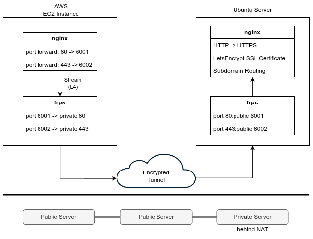

# Reverse Proxy Behind NAT
  
This repository implements a tunneling architecture using `frp` to expose a private server to the public internet. The public server acts as a simple L4 relay, forwarding HTTP/HTTPS traffic to the private server. The private server handles all Nginx logic—SSL termination, static files, and reverse proxying. This design **decouples the public and private layers**, allowing the private Nginx to operate standalone.

## Prerequisites
- A server with a public IP
- A private server behind NAT 
- A domain name pointing to the public IP

## Setup
### frp (Fast Reverse Proxy)
#### frps (Public Server)
Deploy on the public server.

1. Configure `public/frps/frps.toml`.
    ```toml
    bindPort = 7000     # port for frp client to connect on
    ```
2. Run the server:
   ```bash
   cd public/frps
   docker compose up -d --build
   ```

#### frpc (Private Server)
Deploy on the private server.

1. Configure `private/frpc/frpc.toml`
    - Ensure `serverAddr` points to the Public Server's IP.
    ```toml
    [[proxies]]
    name = "ssh"           # example: ssh bypass
    type = "tcp"
    remotePort = 6000      # listen on public port 6000
    localIP = "127.0.0.1"
    localPort = 22         # forward to local port 22
    ```
2. Run the client:
    ```bash
    cd private/frpc
    docker compose up -d --build
    ```

### Nginx

#### Public Server
Ensure `frp` tunnels are active. The public Nginx listens on ports 80/443 and forwards traffic to the local ports exposed by `frps` (e.g., 6001, 6002).

```bash
cd public/nginx
docker compose up -d
```
#### Private Server
1. Configure `.env` for SSL certificates.
2. Configure `nginx.conf` and add subdomains in `subdomains/*.conf`.

```bash
cd private/nginx
docker compose up -d --build
```
